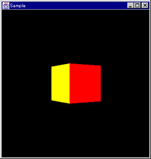

Joystick for Java
------------------------

This package is a development package for Java to use joysticks avaiable for Windows 9x/NT platforms on Java platforms. 

### Class Overview

#### Joystick Class

```
public class Joystick {
  public Joystick(int id);
  public float getXPos();
  public float getYPos();
  public void getButtons();
}
```

#### Joystick(int id)

This constructor creates an instance that is used to communicate with a specified joystick. Specify a number of the game port into the id argument. If you want to use a joystick that is connected with the game port 1, specify 0 into the argument.

#### float getXPos()

This method returns a current horizontal position.

#### float getYPos()

This method returns a current verticality position.

#### int getButtons()

This method retruns a current button infomation. Use the following constants are defined in the class to determine whether the buttons are currently pressd.

CONSTANT | VALUE
---|---
Joystick.BUTTON1 | 0x0001
Joystick.BUTTON2 | 0x0002
Joystick.BUTTON3 | 0x0004
Joystick.BUTTON4 | 0x0008

For example, If you want to know whether the button1 is currently
pressed ....

```
Joystick joy = new Joystick( .... );
int button = joy.getButtons();
if ((button & Joystick.BUTTON1) != 0)
    ........
```

### Sample

#### Input Device Driver for Java3D

This is a simple input device driver for Java3D using the joystick driver, and you can walk in the world using the joystick.



Moving the jostick forward or backward moves forward or backward along Z axis. Moving the joystick right or left yaws around Y axis. When the button1 and the button2 are pressed, the position is reseted.

### Revision

Revision | Date | Note
---|---|---
1.0 | 1999/05/14 | The first release.

### License

This package is provided "AS IS". Licenser disclaims all warranties,
including but not limited to, all express or implied warranties of
merchant ability and fitness for a particular purpose. Everyone can use
the package for commerce or personal purposes free.
